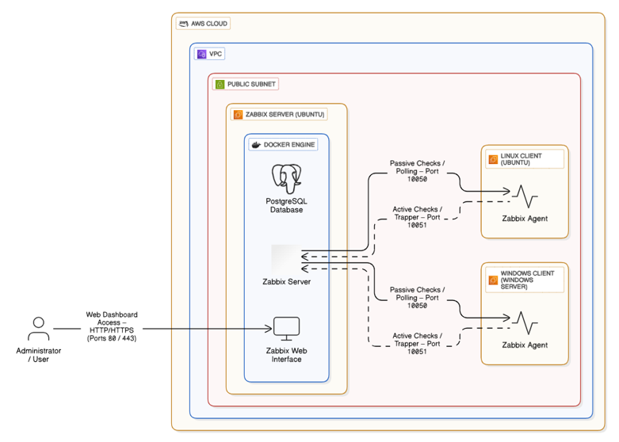
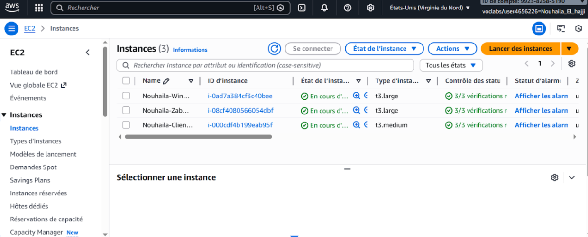
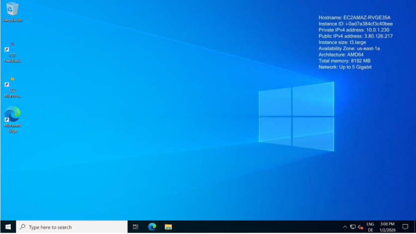
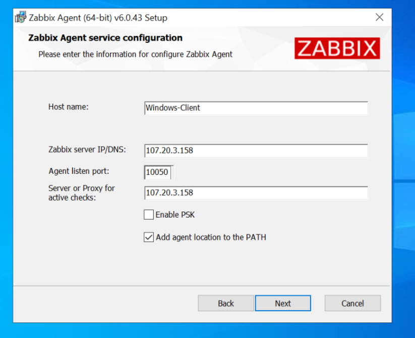
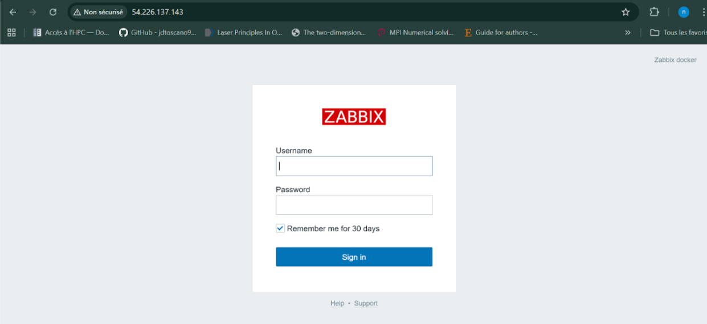
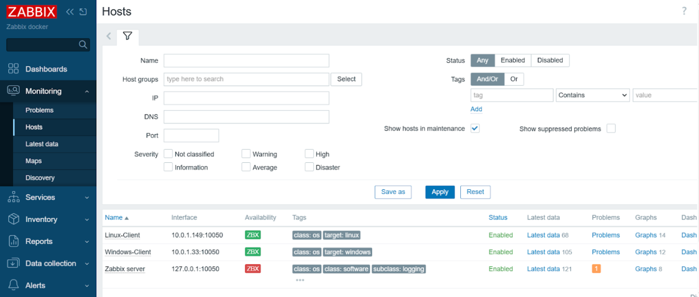
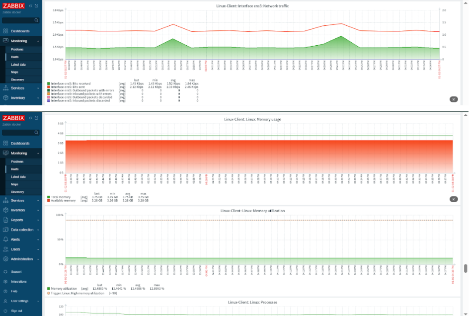
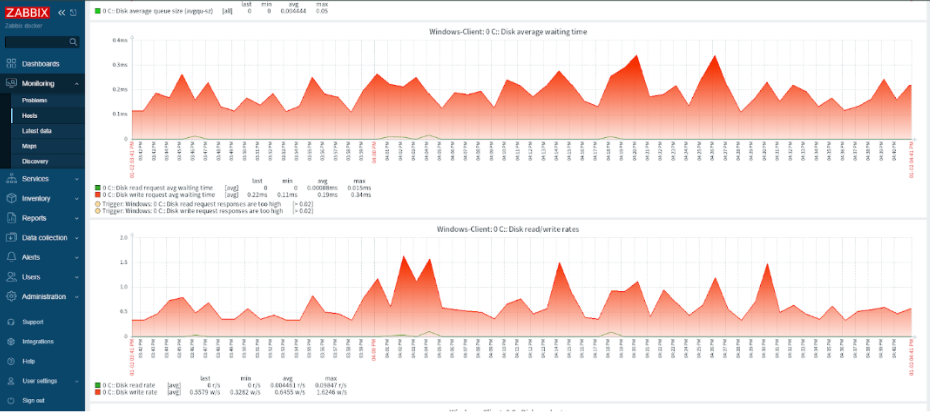

# AWS Monitoring with Zabbix – Linux & Windows Clients

## Introduction
Ce projet met en place une architecture complète de supervision (monitoring) dans le cloud AWS. Il utilise **Zabbix** comme solution de supervision centrale, déployée via **Docker** sur une instance EC2 Ubuntu. Le serveur supervise deux machines clientes : une machine **Linux (Ubuntu)** et une machine **Windows Server**. L'objectif est de démontrer comment orchestrer la surveillance d'un environnement hybride (Linux/Windows) via des agents Zabbix communicant avec un serveur central.

##  Objectifs

- Déployer un serveur Zabbix conteneurisé sous AWS
- Superviser des machines Linux et Windows
- Centraliser le monitoring (CPU, RAM, disponibilité)
- Mettre en place une architecture cloud simple et sécurisée
- Exploiter Docker pour l’orchestration des services Zabbix

---

##  Technologies utilisées

- **AWS EC2 / VPC / Security Groups**
- **Docker & Docker Compose**
- **Zabbix Server / Zabbix Agent**
- **Ubuntu Server 22.04**
- **Windows Server**
- **Git & GitHub**

---

##  Architecture de l’infrastructure

L’architecture déployée repose sur :
- Un VPC avec un subnet public
- Un serveur Zabbix (Ubuntu + Docker)
- Un client Linux (Ubuntu)
- Un client Windows (Windows Server)

## Architecture générale
Le système repose sur trois instances AWS EC2 interconnectées :
1.  **Zabbix Server** : Hébergé sur une instance Ubuntu, il exécute Zabbix (Server + Frontend web) et la base de données via Docker et Docker Compose.
2.  **Linux Client** : Instance Ubuntu avec l'agent Zabbix installé.
3.  **Windows Client** : Instance Windows Server avec l'agent Zabbix installé.

La communication se fait via les ports standards Zabbix :
-   **10050** : Port d'écoute de l'agent (Server -> Agent).
-   **10051** : Port d'écoute du serveur (Agent -> Server / Trapper).

Le serveur Zabbix est déployé de manière conteneurisée utilisant `docker` et `docker-compose`, garantissant une installation rapide et reproductible.


Figure 1 : Diagramme de l'architecture réseau AWS et des flux de communication

## Structure du projet

```
aws-zabbix-monitoring/
├── docker/
│   └── docker-compose.yml      # Configuration pour déployer Zabbix Server
├── agents/
│   ├── Linux/
│   │   └── zabbix_agentd.conf  # Fichier de config pour l'agent Linux (Ubuntu)
│   └── windows/
│       └── zabbix_agent.conf   # Fichier de config pour l'agent Windows
└── README.md                   # Documentation du projet
```

## Tableau des machines EC2

| Nom de l’instance | Rôle | Système d’exploitation | Type d’instance | Ports ouverts (Security Groups) | Description |
| :--- | :--- | :--- | :--- | :--- | :--- |
| **Zabbix Server** | Serveur de supervision | Ubuntu Server 22.04 | t2.medium (recommandé) | 80/443 (Web), 10051 (Zabbix Server), 22 (SSH) | Héberge les conteneurs Docker (Frontend, Server, DB). |
| **Linux Client** | Machine surveillée | Ubuntu Server 22.04 | t2.micro | 10050 (Agent Zabbix), 22 (SSH) | Client Linux standard avec Zabbix Agent installé. |
| **Windows Client** | Machine surveillée | Windows Server 2019/2022 | t2.small | 10050 (Agent Zabbix), 3389 (RDP) | Client Windows avec Zabbix Agent installé. |



Figure 2 : Instance EC2 en état Running


## Déploiement du serveur Zabbix

Le déploiement se fait sur l'instance **Zabbix Server** (Ubuntu).

1.  **Installation de Docker** :
    ```bash
    sudo apt update
    sudo apt install -y docker.io
    sudo usermod -aG docker $USER
    # Déconnexion/Reconnexion nécessaire pour prendre en compte le groupe
    ```

2.  **Installation de Docker Compose** :
    ```bash
    sudo apt install -y docker-compose
    ```

3.  **Création et lancement** :
    Transférez le dossier `docker/` contenant le fichier `docker-compose.yml` sur le serveur.
    ```bash
    cd docker
    docker-compose up -d
    ```

4.  **Vérification** :
    Les conteneurs doivent être en statut "Up".
    ```bash
    docker ps
    ```

## Configuration des agents Zabbix

Les fichiers de configuration pré-configurés sont disponibles dans le dossier `agents/`.

### Configuration de l’agent Zabbix sur Linux
1.  Installer l'agent :
    ```bash
    sudo apt install -y zabbix-agent
    ```
2.  Remplacer la configuration par défaut par celle fournie dans le dépôt (`agents/Linux/zabbix_agentd.conf`).
    Assurez-vous de renseigner l'IP du serveur Zabbix dans les champs `Server=` et `ServerActive=`.
3.  Redémarrer le service :
    ```bash
    sudo systemctl restart zabbix-agent
    ```

### Configuration de l’agent Zabbix sur Windows
1.  Télécharger et installer l'agent Zabbix (MSI) depuis le site officiel.
2.  Aller dans le dossier d'installation (ex: `C:\Program Files\Zabbix Agent\`).
3.  Remplacer le fichier `zabbix_agentd.conf` par celui fourni dans `agents/windows/zabbix_agent.conf`.
4.  Éditer le fichier pour y mettre l'IP privée de votre serveur Zabbix.
5.  Redémarrer le service "Zabbix Agent" depuis la console des services (`services.msc`).


Figure 3 : Connexion RDP au client Windows


Figure 4 : Configuration de l’agent Zabbix lors de l’installation sur Windows

## Ajout des hôtes dans l’interface Zabbix

1.  Se connecter à l'interface web (http://[IP-Publique-Serveur-Zabbix]).


Figure 5 : Page de connexion de l’interface Web Zabbix via l’IP publique du serveur


Figure 6 : Page de Dashboard de l’interface Web Zabbix


2.  Naviguer vers **Configuration > Hosts**.
3.  Cliquer sur **Create host**.
4.  Remplir les champs :
    *   **Host name** : Doit être identique à celui configuré dans le fichier `.conf` de l'agent.
    *   **Templates** : Choisir `Linux by Zabbix agent` ou `Windows by Zabbix agent`.
    *   **Interfaces** : Ajouter une interface de type **Agent**, port **10050**, avec l'IP privée du client.
5.  Après quelques instants, l'icône **ZBX** doit passer au **vert** dans la liste des hôtes.

## Intégration des hôtes
Les deux clients (Linux et Windows) ont été ajoutés manuellement dans l'interface de gestion Zabbix ("Configuration > Hosts").

Attribution des Templates
Pour garantir une supervision pertinente, des modèles (Templates) adaptés ont été appliqués :

Linux : Linux by Zabbix agent
Windows : Windows by Zabbix agent
Vérification du statut
La réussite de la configuration est validée par l'icône ZBX passant au vert dans la liste des hôtes, indiquant une communication fonctionnelle.


Figure 7 : Statut des hôtes Linux et Windows supervisés (ZBX vert)  dans Zabbix


## Sécurité et bonnes pratiques

*   **Security Groups AWS** :
    *   Le port **10050** sur les clients ne doit accepter le trafic *que* depuis l'IP du serveur Zabbix (Security Group Reference).
    *   L'interface web (port 80) peut être restreinte à votre IP personnelle pour plus de sécurité.
*   **Limitation des ports** : Seuls les ports strictement nécessaires sont ouverts.
*   **Séparation des rôles** : Le serveur de monitoring est isolé des clients supervisés.
*   **Best Practices** : Utilisation de Docker pour isoler l'environnement serveur et faciliter les mises à jour.

## Résultats obtenus

*   **Agents connectés** : Statut de disponibilité "Available" (Vert) pour le client Linux et le client Windows.
*   **Supervision fonctionnelle** : Remontée des métriques en temps réel (Charge CPU, Utilisation mémoire, Espace disque, Trafic réseau).
*   **Visualisation** : Création de tableaux de bord (Dashboards) pour visualiser l'état de santé de l'infrastructure hybride.

## Visualisation des Métriques
Des tableaux de bord (Dashboards) permettent de visualiser en temps réel les indicateurs clés de performance (KPIs) :

CPU Utilization : Charge processeur.
Memory Usage : Consommation de la mémoire vive.
System Uptime : Temps de disponibilité de la machine.


Figure 8 : Graph Client Linux


Figure 9 : Graph Client Windows

## Conclusion

Ce projet académique a permis de mettre en œuvre une solution de monitoring professionnelle avec **Zabbix** sur une infrastructure Cloud **AWS**. La configuration hybride (Linux/Windows) démontre la flexibilité de l'outil et l'importance d'une supervision centralisée pour garantir la disponibilité et la performance des systèmes d'information.
